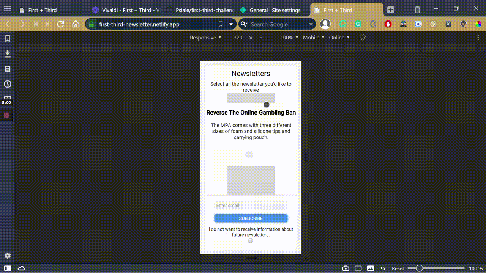

# 📋✅ First + Third Challengue


This project focuses on creating the First and Third Frontend test design.

## 🧮 The Project Brief

The premise of this project is to create a Newsletter page that allows the user to select newsletter from a list and then click a button to subscribe.
The user should receive an error or success message as a response to this action.

## 🖼️ Preview



## 🧬 Technologies & Languages Used

- JavaScript
- Stylelint
- Eslint
- Animista
- SCSS
- Webpack
- Netlify

## 🔰 Setup & Usage

### ⌨️ Local 

1. Go to the [repository](https://github.com/Psiale/first-third-challenge) and press on the green button that says ```code```
2. Copy the link and open a terminal 

    windows:

    ```windows tab + x ```

    mac: Press ```CmdSpace``` to open spotlight search and type ```terminal``` and hit ```return ```.


3. Go to the folder where you gonna clone the repositorie and type ```git clone PASTE THE LINK``` and hit ```Enter ```

4. Go the the project root and type ``` yarn/npm run start ```

## 🚀 Live version
[visit the page](https://first-third-newsletter.netlify.app)

## 🛎️ Contributions, Issues & Forking

If you have any issues setting up the project or you come across any unintended bugs or problems, please do submit an issue to the [first-third-challengue](https://github.com/Psiale/first-third-challenge/issues) page.

If you want to make your own changes, modifications or improvements to our project, go ahead and Fork it!
1. [Fork it](https://github.com/Psiale/first-third-challenge/fork)
2. Create your working branch (git checkout -b [choose-a-name])
3. Commit your changes (git commit -am 'what this commit will fix/add/improve')
4. Push to the branch (git push origin [chosen-name])
5. Create a new Pull Request

## 🤟🏽😄 😛🤙🏾  Creator

Alexis Sanchez - [Github](https://github.com/Psiale)

## 🙌🏾 Show Your Support

Give a ⭐️ if you like this project!
